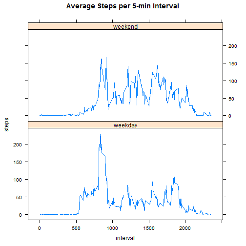

# Reproducible Research: Peer Assessment 1

## Loading and preprocessing the data
First read in the data and format the date properly

```r
stepData <- read.csv("./activity.csv", header = TRUE)
stepData$date <- as.Date(stepData$date,format="%Y-%m-%d")
rowcount <- nrow(stepData)
```
There are  r rowcount` observations

## What is mean total number of steps taken per day?
First sum the steps by day

```r
stepsDay <- aggregate(stepData$steps ~ stepData$date,FUN = "sum")
colnames(stepsDay) <- c("date","steps")
```
Then create a histogram of steps taken each day

```r
hist(stepsDay$steps)
```

 

And use summary to get the mean and median steps per day

```r
summary(stepsDay)
```

```
##       date                steps      
##  Min.   :2012-10-02   Min.   :   41  
##  1st Qu.:2012-10-16   1st Qu.: 8841  
##  Median :2012-10-29   Median :10765  
##  Mean   :2012-10-30   Mean   :10766  
##  3rd Qu.:2012-11-16   3rd Qu.:13294  
##  Max.   :2012-11-29   Max.   :21194
```


## What is the average daily activity pattern?
First aggregate by interval to get mean steps per interval

```r
stepMean <- aggregate(stepData$steps ~ as.factor(stepData$interval),FUN = "mean")
colnames(stepMean) <- c("interval","meanSteps")
```
Next create a time series plot of average steps per 5-minute interval

```r
with (stepMean, plot(interval, meanSteps, type="l"))
```

 
The 5-min interval with maximum average steps is 

```r
stepMean[stepMean$meanSteps==max(stepMean$meanSteps),] 
```

```
##     interval meanSteps
## 104      835     206.2
```


## Imputing missing values

Impute missing values using interval mean; use sqldf because it's easier

```r
require(sqldf)
```

```
## Loading required package: sqldf
## Loading required package: gsubfn
## Loading required package: proto
## Loading required package: RSQLite
## Loading required package: DBI
## Loading required package: RSQLite.extfuns
```

```r
stepDataFix <- sqldf("select a.interval, 
                     a.date, 
                     CASE when steps = 'NA' then b.meanSteps  
                     when steps is null then b.meanSteps  
                     else steps end steps from stepData a  
                     left join stepMean b on a.interval = b.interval")
```

```
## Loading required package: tcltk
```
The "is null" was added removes all the NA values
Remaining NA values = 0

Now summarize this new result by day and create histogram

```r
stepsDayFix <- sqldf("select a.date,
                     sum(steps) steps
                     from stepDataFix a
                     group by a.date")
hist(stepsDayFix$steps)
```

 

```r
Fixmean <- summary(stepsDayFix$steps)[4]
Fixmedian <- summary(stepsDayFix$steps)[3]
```


## Are there differences in activity patterns between weekdays and weekends?
Using the dataset that replaces NA values with interval means;
First add column for weekday, then convert it to  
a binary weekday/weekend factor variable

```r
stepDataFix$weekday <- weekdays(stepDataFix$date)
stepDataFix$weekend <- cut(as.numeric(stepDataFix$weekday=="Saturday"|
                              stepDataFix$weekday=="Sunday"),2,
                           labels=c("weekday","weekend"))
with (stepDataFix, table(weekday, weekend))  ## check to ensure correct
```

```
##            weekend
## weekday     weekday weekend
##   Friday       2592       0
##   Monday       2592       0
##   Saturday        0    2304
##   Sunday          0    2304
##   Thursday     2592       0
##   Tuesday      2592       0
##   Wednesday    2592       0
```
Now use SQL to aggregate to get mean by interval and weekend/weekday

```r
stepsWeekend <- sqldf("select interval, weekend,
                     avg(steps) steps
                     from stepDataFix a
                     group by interval, weekend")
```
And prepare chart using lattice

```r
require(lattice)
```

```
## Loading required package: lattice
```

```r
xyplot(steps ~ interval | weekend, layout=c(1,2),
       data=stepsWeekend, t="l", main="Average Steps per Interval")
```

 
The chart shows that weekday steps rise around 5:30am and peak between 8am and 9am, and then drop off sharply for the rest of the day.  During the weekend, steps start lower in the morning, but are generally higher the rest of the day, and continue later into the evening.
